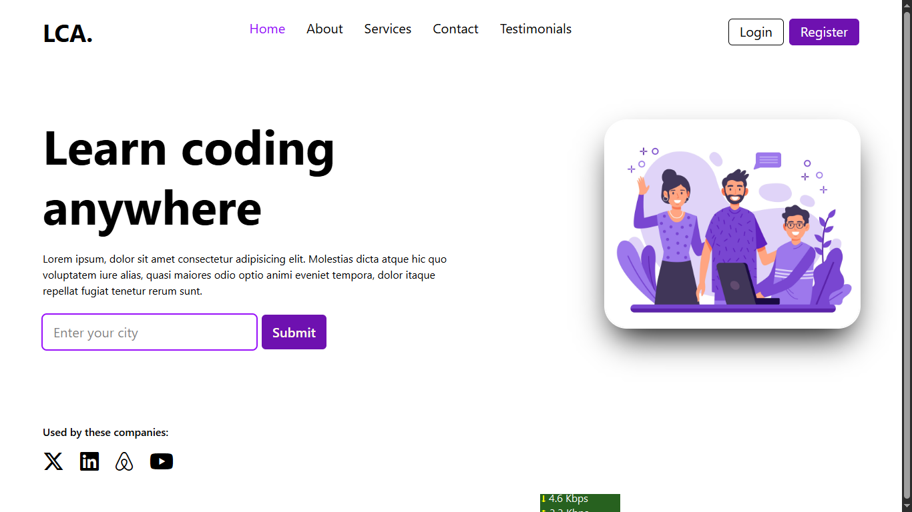

# Responsive React Website 🌐

This is a fully responsive multi-page website built with React, React Router, and Tailwind CSS.

## 🚀 Tech Stack
- React
- React Router
- Tailwind CSS

## Screenshot
<!--  -->

<!--  -->

## 📦 Setup
Clone the repo and run:

```bash
npm install
npm run dev


